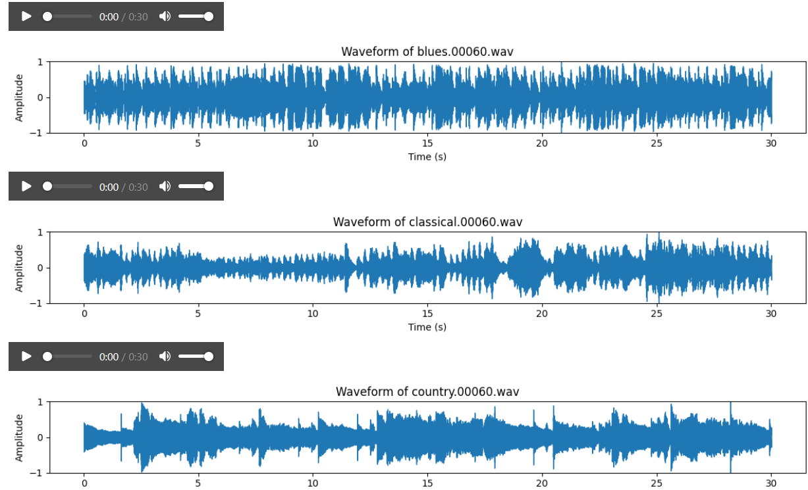
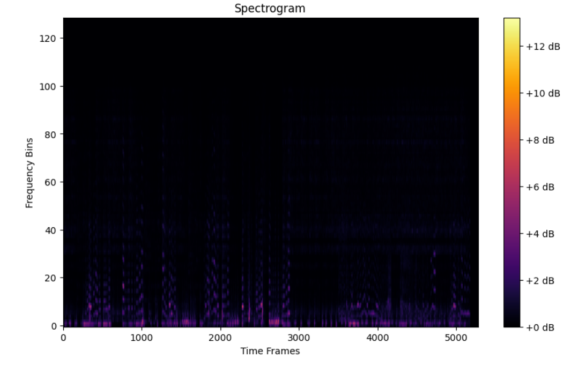

# Genre Classification of Audio Signals using Neural Networks

The primary goal of this project is to develop an audio classifier that accurately identifies and categorizes songs into one of ten predefined music genres: blues, classical, country, disco, hip-hop, jazz, metal, pop, reggae, and rock. By leveraging deep learning techniques, the project aims to analyze audio signals and extract meaningful features for effective classification.

## Resources Used

**Python Version**: 3.12.1

**Packages**: pandas,numpy, os, librosa, pydup, IPython, matplotlib, tensorflow , keras, sklearn, tqdm

**Dataset**: https://www.kaggle.com/datasets/andradaolteanu/gtzan-dataset-music-genre-classification

## Data Visualization

An example of waveform for each genre was visualized.

## Data Preparation

Depending on the model, different techniques to extract information from the data were used:

MFCCs (Mel-frequency Cepstral Coefficients): to capture the power spectrum of an audio signal in a way that reflects how humans perceive sound.
Extraction of Chroma Features ( represent the energy distribution of pitches (or notes) in an audio signal, focusing on the 12 distinct semitones of the octave), Spectral Contrast (measures the difference in amplitude between peaks and valleys in a sound spectrum, indicating the timbral texture of audio) and Tonnetz ( represent the harmonic relations and tonal centroid features of the audio signal, focusing on the relationships between pitch classes)
Spectogram Extraction: it converts an audio signal from the time domain into a visual representation in the time-frequency domain.

## Neural Network Building

7 different models were conducted.
