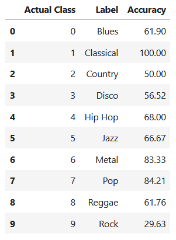

# Genre Classification of Audio Signals using Neural Networks

The primary goal of this project is to develop an audio classifier that accurately identifies and categorizes songs into one of ten predefined music genres: blues, classical, country, disco, hip-hop, jazz, metal, pop, reggae, and rock. By leveraging deep learning techniques, the project aims to analyze audio signals and extract meaningful features for effective classification.

## Resources Used

**Python Version**: 3.12.1

**Packages**: pandas,numpy, os, librosa, pydup, IPython, matplotlib, tensorflow , keras, sklearn, tqdm

**Dataset**: https://www.kaggle.com/datasets/andradaolteanu/gtzan-dataset-music-genre-classification

## Data Visualization

An example of waveform for each genre was visualized.

## Data Preparation

Depending on the model, different techniques to extract information from the data were used:

MFCCs (Mel-frequency Cepstral Coefficients): to capture the power spectrum of an audio signal in a way that reflects how humans perceive sound.
Extraction of Chroma Features ( represent the energy distribution of pitches (or notes) in an audio signal, focusing on the 12 distinct semitones of the octave), Spectral Contrast (measures the difference in amplitude between peaks and valleys in a sound spectrum, indicating the timbral texture of audio) and Tonnetz ( represent the harmonic relations and tonal centroid features of the audio signal, focusing on the relationships between pitch classes)
Spectogram Extraction: it converts an audio signal from the time domain into a visual representation in the time-frequency domain.

## Neural Network Building

Seven distinct models were implemented, each varying in specific parameters and data preparation techniques. The parameters adjusted included:

* Number of epochs
* Optimizer
* Callbacks
* Batch normalization
* Early stopping
* Convolutional layers
* Flattening techniques
* Learning rate reduction (Reduce_lr)
* L2 regularization

Additionally, varied data preprocessing methods were applied across models to optimize performance and assess the impact of each parameter.

## Best Model Selection

The model that performed the best was the second model, reaching a 0,62% in accuracy, and is the model that better handles the problem of overfitting (which is possible to see by comparing training and validation accuracy).

The model arquitecture is the following:

* Input Layer, which a shape of (40,)
* First Layer: It is a dende layer that has 128 neurons, which helps capture patterns from the input data. Batch Normalization to stabilize and accelerate training is done, as well as ReLu Activation so the model learns complex patters by introducing non-linearity and Dropout of 0,5 for regularization.
* Second Layer: Same as before, but this time with 256 units to capture more complex interactions.
* Third Layer: with 128 units, reduced neuron count from the second layer to refine learned patterns.
* Final Layer: It is a dense layer with 10 units, needed to match the 10 output classes, and uses softmax activation which converts the output to probabilities for multi-class classification.

For compilation and training, Adam optimizer is chosen, which is effective for many problems due to its adaptive learning rate and for the loss function, categorical cross-entropy, suitable for multi-class problems with one-hot encoded labels.

The Early Stopping Callback is implemented as well to monitor validation loss, and if it doesn’t improve for 10 epochs, training stops early. It also restores the best weights, avoiding overfitting.

A Second Jupyter notebook will be conducted, where only this model makes predictions. It would have been better to do it here, but unfortunately I did not plan it well enough, as I called all the models simply "model", so to redundancy by coding this neural network again, or correcting and running it all again, which due to the last model, takes a while. This Jupyter notebook is to be find in the same Github Repo as this one.

  

## Predictions

By predicting the genres in unknown data, the accuracy reaches 64,4%.
It is really interesting to see how much the accuracy varies among all the diferent genders, specially considering that the data is totally balanced. (there are 100 audio samples for each genre).

It catches my attention that classical reaches a 100% of accuracy, which might be attributed to its distinctive melodies. This uniqueness could also explain the high accuracy observed for metal. . I would have the accuracy for Pop to be lower, and for Hip Hop or Reggae to be higher.

It should be mention that I have no background knowledge of music, as I do not play any instruments, and I listen to it just as a hobby.

The accuracy in Rock is so low, that if it was left out, the overall accuracy would increased by 6%.

  
